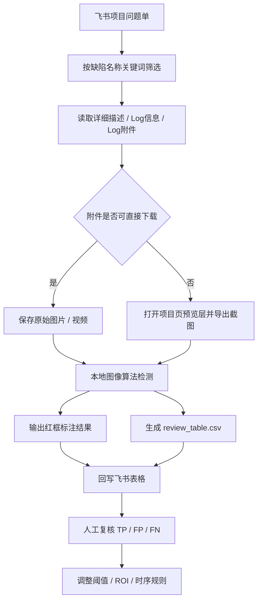

# 屏幕异常问题单自动汇总 Skill

## 目标

从飞书项目问题单中筛选指定屏幕异常关键词，下载或导出问题证据文件，运行图像检测算法，回写飞书表格，并形成可人工复核的数据闭环。

适用异常类型：

| 异常类型 | 关键词示例 | 检测目标 |
|---|---|---|
| 黑屏 | 黑屏 | 屏幕区域大面积低亮度、无有效画面 |
| 花屏 | 花屏 | 屏幕区域纹理/颜色异常、块状噪声 |
| 闪屏 | 闪屏 | 连续帧亮度或颜色突变 |
| 冻屏 | 冻屏 | 连续帧变化量低于阈值 |
| 白屏 | 白屏 | 屏幕区域大面积高亮、无有效画面 |

## 架构



## 配置矩阵

| 参数 | 示例 | 说明 |
|---|---|---|
| project_url | 飞书项目问题单入口 | 用于按关键词筛选问题单 |
| sheet_url | 飞书表格链接 | 用于回写问题数量、附件路径、检测结果 |
| sheet_id | 目标工作表 ID | 示例：黑屏问题表 |
| keyword | 黑屏 / 花屏 / 闪屏 / 冻屏 / 白屏 | 缺陷名称筛选条件 |
| data_root | `C:\Users\XGTech_ZHU\Pictures\black-screen\data_source` | 本地样本保存目录 |
| output_dir | `data_root\detected_results` | 红框结果、JSON、CSV 输出目录 |
| review_columns | L:W | 自动化结果回写列 |

## 推荐流程

1. 在飞书项目中筛选问题单。

   - 条件：缺陷名称包含目标关键词。
   - 可选条件：Log附件不为空。
   - 输出：问题单号、标题、详细描述、Log信息、附件列表。

2. 更新飞书表格问题清单。

   - 保留已有人工字段。
   - 在空列写入自动化检测字段。
   - 对无法下载原始附件的样本，记录替代证据来源。

3. 下载或导出证据文件。

   - 优先保存原始 mp4 / jpg / png。
   - 如果项目文件接口需要额外鉴权，打开附件预览层并导出真实预览截图。
   - 按问题单号建目录保存。

4. 运行检测算法。

```powershell
python "C:\Users\XGTech_ZHU\Pictures\black-screen\analyze_black_screens.py" `
  --root "C:\Users\XGTech_ZHU\Pictures\black-screen\data_source" `
  --recursive
```

5. 回写检测结果。

   - 异常类型：black_screen / color_screen / flicker / freeze / white_screen。
   - 开始时间：视频异常开始时间；单帧图片写 0。
   - 结束时间：视频异常结束时间；单帧图片写 0。
   - 置信度：规则命中分数或模型置信度。
   - 命中原因：阈值、ROI、亮度、颜色、帧差等关键证据。
   - 红框结果路径：本地标注文件路径。
   - 人工复核结论：默认写“待复核”。

6. 人工复核并更新算法。

   - TP：算法标注位置正确。
   - FP：算法误报。
   - FN：算法漏检。
   - 根据反馈调整 ROI、阈值、连续帧窗口和异常合并规则。

## 自动化脚本或附件

| 脚本 | 用途 |
|---|---|
| `analyze_black_screens.py` | 检测图片或视频中的黑屏区域，输出红框标注、JSON 汇总和 CSV 复核表 |
| `usb_camera_preview.py` | 摄像头实时预览和黑屏检测，用于台架复现时捕捉异常 |
| `review_table.csv` | 待人工复核的异常片段汇总 |
| `summary.json` | 算法完整输出，供后续调参和追溯 |

## 验证方法

| 指标 | 定义 | 最小验收建议 |
|---|---|---|
| TP | 人工确认异常，算法也检出 | 样本级和片段级分别统计 |
| FP | 人工确认正常，算法检出异常 | 低于项目可接受误报阈值 |
| FN | 人工确认异常，算法未检出 | 优先降低漏报 |
| 起止时间误差 | 算法异常区间与人工标注区间差值 | 摄像头检测建议控制在 0.5s 内 |
| 可复查输出 | 是否有红框图、视频片段或 contact sheet | 必须输出 |

## 已验证操作细节（2026-07-10 跑通）

### 问题数量核对（步骤 1）

- 问题单主页筛选 chip：`筛选·缺陷名称 包含 <关键词>`，点 chip 修改值即可，无需重建条件。
- 列表是 Canvas 渲染、无"共 N 条"直读入口。**取总数方法**：设置一个低基数「分组」（如 关闭类型），按 `Ctrl + Shift + G` 收起全部分组，各分组头显示 `共 N 个`，求和即总数（含"空值"组）。
- 数量与表格不一致时：按问题单号倒序，顶部即新增单；补录到表格末尾（A 分类 / B 单号 / C 标题），并用 `sheets +sheet-rename` 更新 sheet 名中的数量。

### 附件下载（步骤 3）

- **筛单规则（2026-07-10 更新）：只下载"含视频附件（mp4等）"的问题单**。仅有白底日志/云端截图的单不下载——这类图片非屏幕实拍，算法必然零命中，无训练/复核价值（当次试跑 4/5 单均为此类）。判断方式：详情页 get_page_text 的"已上传文件"清单中含 `.mp4/.mov` 才入选；详细描述内嵌实拍图片可作为补充证据一并保存。
- **目录结构（对齐 `screen-flicking/data_source`）**：每单一个文件夹，媒体文件保留**原始文件名**：
  ```
  data_source/
    GUA1260213D6798765436/
      2.mp4                      # 原始附件名
      download_manifest.json     # issue/row/url/downloaded[{name,kind,contentType,size,sourceUrl}]/visibleMediaNames
  ```
  检测产物统一输出到 `data_source/detected_results/`（`--recursive` 运行时 issue_id 自动取父文件夹 GUA 号）。
- 详情页 Log附件 区每个文件行右侧有独立 `下载` 图标，点击即触发浏览器下载。
- ⚠️ **本机环境会在下载完成后立刻删除 Downloads 中的文件**（安全策略；且观察到 `data_source` 根目录下的 .jpg 文件也可能在数分钟后被清除——媒体文件落盘后应立即移入 GUA 子文件夹，检测产物 png/csv 未见被清）。对策：点击下载前先启动后台轮询（200ms 间隔），把 `Downloads/*.tmp|*.crdownload|*.jpg|*.mp4` 抢拷到 `data_source\_grab`，完成后校验文件头（jpg=FFD8、mp4 含 ftyp）再重命名。
- 命名规范：`<问题单号>_<缺陷名称>.<ext>`；同单多文件加 `_1/_2` 后缀。
- Monica 扩展 `about:blank#blocked` iframe 会挡住扩展工具：**navigate 后同一批次内**立即执行 purge JS（移除全部 iframe + MutationObserver 持续清除），再等待 18s 渲染。
- Chrome 窗口被最小化时截图只有 115px 高：用 PowerShell `ShowWindowAsync(hwnd, 9)` 恢复（EnumWindows 找 IsIconic 的 Chrome 窗口）。

### 证据分级（重要）

| 附件类型 | 特征 | 处理 |
|---|---|---|
| 屏幕实拍照片/录像 | 均值低、有黑色屏幕候选区 | 算法主检对象 |
| OTA云端/串口日志白底截图 | 灰度均值 >220、暗像素 <5% | **非现象证据**，算法零命中属真阴性，命中原因注明"非屏幕实拍" |
| mp4 录像 | 逐帧检测，输出异常区间列表 | 主力样本，优先下载 |

### 回写字段（L:W 列，已建表头）

`L 证据文件｜M 证据类型｜N 异常类型｜O 开始时间(s)｜P 结束时间(s)｜Q 置信度｜R 命中原因｜S 红框结果路径｜T 检测时间｜U 人工复核结论(TP/FP/FN)｜V 复核备注｜W 算法版本`

- 运行命令：`py -3.12 analyze_black_screens.py --root <data_source>`（cv2 装在 Python 3.12）。

## 故障定位表

| 观察 | 判断 | 操作 |
|---|---|---|
| 项目附件无法直接下载 | 缺少 Project 文件接口鉴权 | 使用项目页预览层截图；或补充 Project OpenAPI token 后重新下载原始附件 |
| 缩略条检测未命中 | 输入不是实际屏幕画面 | 打开附件预览层，截取真实画面区域 |
| 整帧被红框覆盖 | 预览层背景过暗或视频未播放到有效帧 | 固定屏幕 ROI，或按时间采样多帧后再判断 |
| 正常暗色 UI 被误报 | 仅亮度规则不足 | 增加 UI 纹理、边缘密度、连续帧稳定性判断 |
| 摄像头反光导致误报 | 局部高反差干扰 | 固定 camera ROI，并增加屏幕边界约束 |

## 说明或限制

- 当前黑屏算法是基于灰度阈值、形态学和候选屏幕区域过滤的规则算法。
- 对摄像头实拍视频，建议固定摄像头位置，并优先配置屏幕 ROI。
- 对视频附件，优先使用原始 mp4；预览截图只能用于快速筛查，不替代最终验收。
- 后续优化接口建议保留：`detect_dark_region(frame)`、`draw_annotation(frame, result, timestamp)`、`process_video(path, tmpdir)`、`process_image(path, tmpdir)`。
- 飞书表格中人工复核列是算法迭代入口，复核结果应明确标注 TP / FP / FN。
